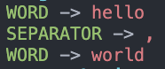

# gotokenizer

This library provide a basic regex based tokenizer.

## Installation

To install the library, you can use the following command:

```sh
go get github.com/StevenCyb/gotokenizer
```

## How to use

```go
package main

import (
	"fmt"
  // Import the package
	"gotokenizer/pkg/tokenizer"
)

func main() {
  // Define token types that you want to classify.
	var (
		WordType      tokenizer.Type = "WORD"
		SeparatorType tokenizer.Type = "SEPARATOR"
		SkipType      tokenizer.Type = "SKIP"
	)

  input := "hello,world"

  // Create a tokenizer
	tokenizer := tokenizer.New(
    // Input to parse
		input,
    // Token that should be skipped e.g. spaces.
		SkipType,
    // Specs for token types and how to identify them.
		[]*tokenizer.Spec{
			tokenizer.NewSpec(`^\s+`, SkipType),
			tokenizer.NewSpec("^[a-z]+", WordType),
			tokenizer.NewSpec("^,", SeparatorType),
		})

	for {
    // Get next token
		token, err := tokenizer.GetNextToken()
		if err != nil {
			panic(err)
		} else if token == nil {
      // At the end
			break
		}

    // Print result (see image below)
		fmt.Printf("\x1B[32m%s\033[0m -> \x1B[31m%s\033[0m\n", token.Type, token.Value)
	}
}
```

